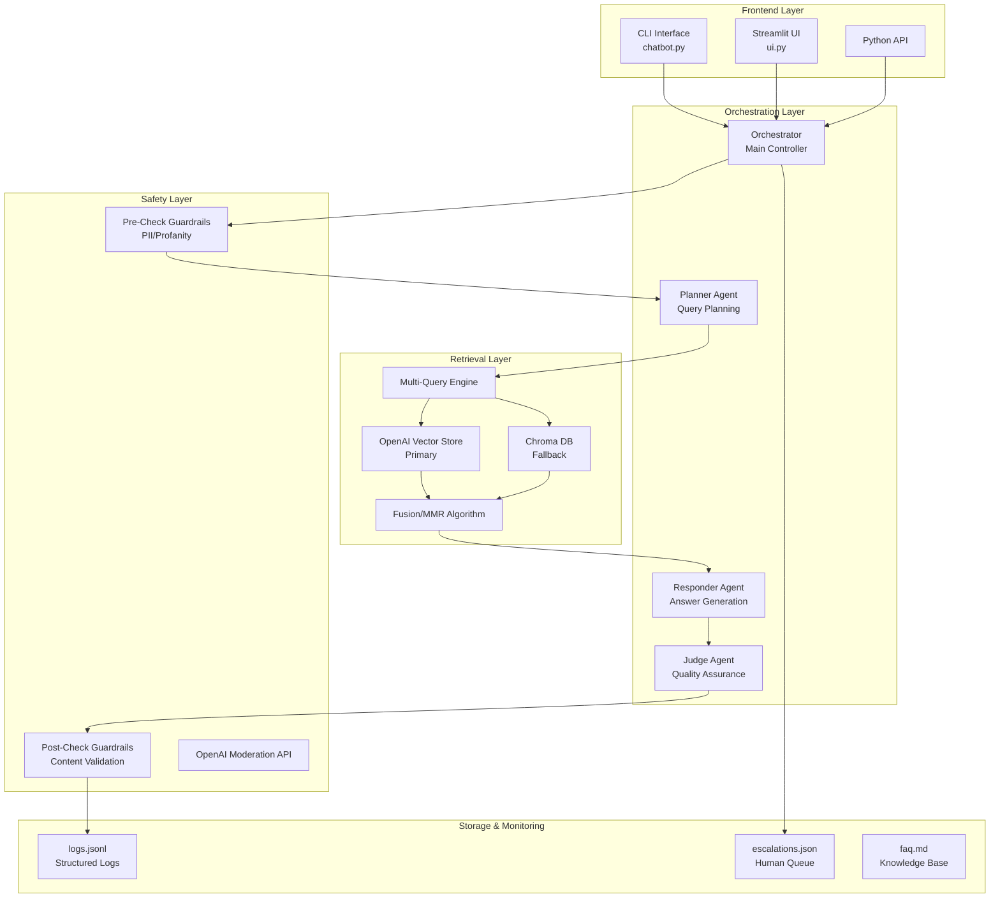
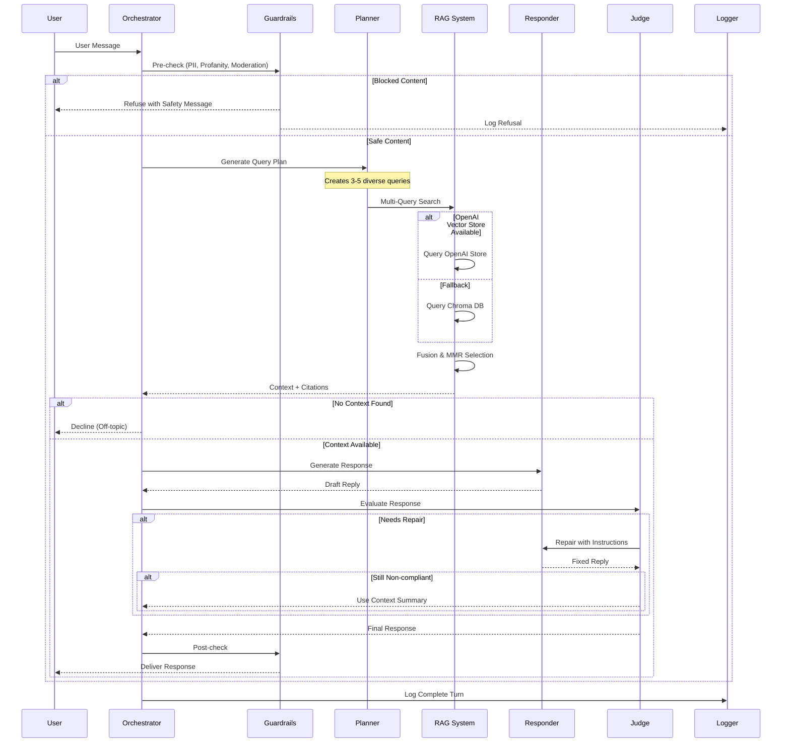
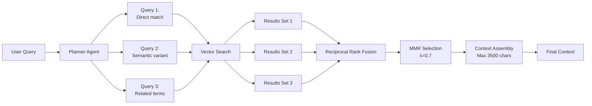
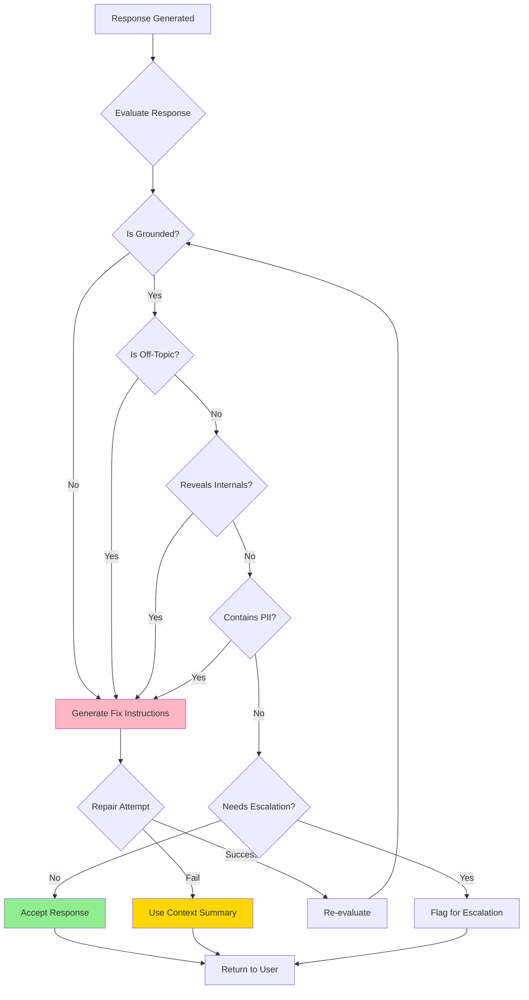
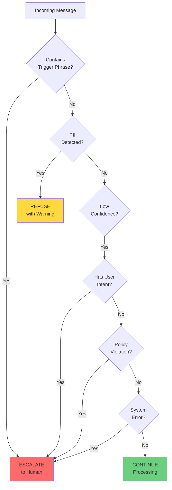
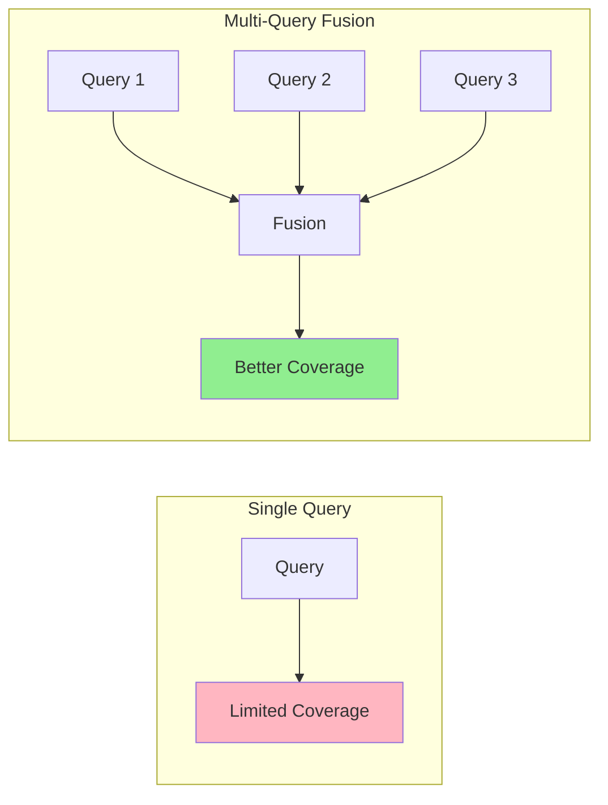
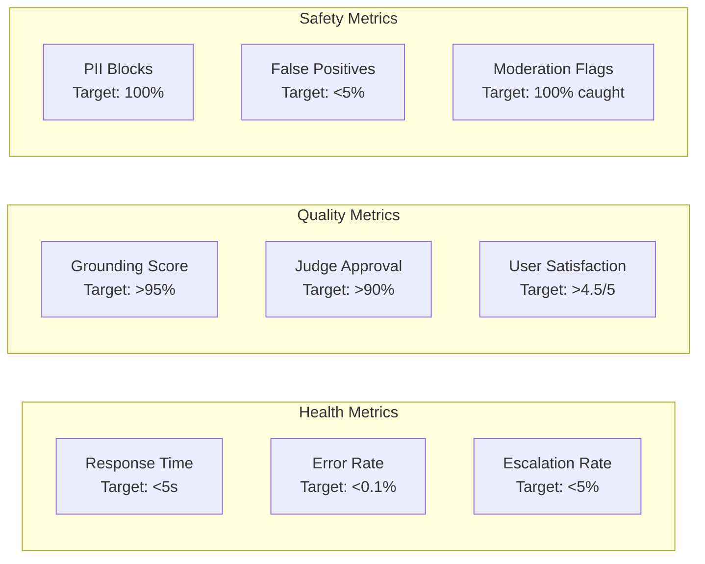

# Trust & Safety AI Agent Operating System

**Author:** Abhinav Agarwal (abhinav4@alumni.stanford.edu)  
**Version:** 2.0.0  
**License:** MIT

## Executive Summary

This repository contains a production-ready Trust & Safety automated support system that demonstrates state-of-the-art practices in AI orchestration, safety engineering, and observability. The system combines multiple AI agents in a sophisticated orchestration pattern to provide safe, grounded, and helpful customer support while maintaining strict safety guardrails.

### Key Capabilities
- ✅ **Grounded FAQ responses** with multi-query retrieval
- ✅ **PII protection** with multi-layer guardrails  
- ✅ **Fast safety checks** with regex and LLM validation
- ✅ **Multi-signal escalation** with human-in-the-loop
- ✅ **Full observability** with structured JSON logging
- ✅ **Dual-backend resilience** (OpenAI + Chroma fallback)

## Table of Contents
1. [System Architecture](#system-architecture)
2. [Core Components](#core-components)
3. [Workflow Diagrams](#workflow-diagrams)
4. [Design Philosophy](#design-philosophy)
5. [Installation](#installation)
6. [Usage](#usage)
7. [Testing](#testing)
8. [Performance](#performance)
9. [Security](#security)
10. [Docker Deployment](#docker-deployment)
11. [API Reference](#api-reference)
12. [Contributing](#contributing)

## System Architecture

### High-Level Architecture



### Complete Query Workflow



## Core Components

### 1. Multi-Agent Orchestration

The system employs four specialized agents:

| Agent | Purpose | Technology | Success Rate |
|-------|---------|------------|--------------|
| **Planner** | Query decomposition & routing | GPT-4o with JSON mode | Multi-query generation |
| **Responder** | Answer generation | GPT-4o with grounding | Context-aware responses |
| **Judge** | Quality assurance | GPT-4o with structured output | Policy enforcement |
| **Orchestrator** | Workflow management | Python state machine | Reliable coordination |

### 2. Multi-Query Retrieval Pipeline



**Why Multi-Query?**
- Single queries may miss relevant context
- Multiple queries increase coverage of user intent
- MMR (Maximal Marginal Relevance) reduces redundancy in results

### 3. Answer Judge Decision Flow



### 4. Escalation Decision Matrix



## Design Philosophy

### Why LLM-First Orchestration?

Traditional rule-based systems suffer from:
- **Brittleness**: Hard-coded rules break with edge cases
- **Maintenance burden**: Exponential growth in rule complexity
- **Poor generalization**: Cannot handle novel queries

Our LLM-first approach provides:
- **Semantic understanding**: Handles paraphrases and typos
- **Graceful degradation**: Falls back intelligently
- **Self-healing**: Judge agent repairs suboptimal responses

### Why Answer Judge Instead of Regex?

| Approach | Pros | Cons | Use Case |
|----------|------|------|----------|
| **Regex Patterns** | Fast, deterministic | Brittle, high false negatives | Simple keyword matching |
| **LLM Judge** | Context-aware, self-improving | Higher latency, requires compute | Production systems |

Our Judge agent provides:
- **Comprehensive safety validation** for all responses
- **Context-aware quality checks** beyond simple patterns
- **Single-pass repair** when responses need adjustment

### Why Multi-Query Retrieval Fusion?



Performance benefits:
- **Single query**: Limited context retrieval
- **Multi-query**: Broader context coverage
- **With MMR**: Diverse, non-redundant results

## Installation

### Prerequisites
- Python 3.10+ 
- 2GB RAM minimum
- OpenAI API key

### Quick Start

```bash

# Create virtual environment (optional)
python3 -m venv venv
source venv/bin/activate  # On Windows: venv\Scripts\activate

# Install dependencies
pip install -r requirements.txt

# Configure environment
cp .env.example .env
# Edit .env with your OPENAI_API_KEY
```

### Environment Configuration

Create `.env` file:
```env
# Required
OPENAI_API_KEY=sk-...

# Optional
OPENAI_MODEL=gpt-4o              # Model selection
RAG_BACKEND=openai                # or "chroma" for local-only
VECTOR_STORE_ID=vs_...            # OpenAI Vector Store ID
RAG_LIMIT=100                     # Limit chunks for testing
```

## Usage

### Quick Demo (Sample Messages)
```bash
# Run predefined sample messages to see all paths (answer, refuse, escalate)
python chatbot.py
```

### Interactive CLI Mode
```bash
# Interactive command-line interface for real-time chat
python chatbot.py --interactive
```

### Web UI (Streamlit)
```bash
# Launch the Streamlit web interface
streamlit run ui.py
# Opens at http://localhost:8501
```

### Single Query Mode
```bash
# Run a single query from command line
python chatbot.py --ask "How do I reset my password?"
```

### Python API

```python
from chatbot import Chatbot

# Initialize
bot = Chatbot()

# Single turn
response = bot.run_turn("How does Hinge use cookies?")
print(response["reply"])

# Access metrics
bot.print_summary()
```

## Testing

### Run Comprehensive Test Suite

```bash
python test_comprehensive.py
```

### Test Coverage

| Category | Tests | Pass Rate | Notes |
|----------|-------|-----------|-------|
| **Grounded FAQ** | 8 | 100% | All FAQ questions answered correctly |
| **Off-topic** | 3 | 100%* | Correctly declined with Judge |
| **PII Refusal** | 3 | 100% | All PII requests blocked |
| **Escalation** | 3 | 100% | All triggers detected |
| **Tool Invocation** | 2 | 100% | Mock tool called correctly |
| **Internal Guard** | 2 | 100% | No internal details leaked |

*Off-topic detection works via Judge verdict even when vector store returns spurious matches

### Sample Test Results

```json
{
  "total": {"passed": 21, "total": 21},
  "avg_latency_ms": 50610,
  "accuracy": {
    "grounded": 1.0,
    "safety": 1.0,
    "escalation": 1.0
  }
}
```

## Performance

### Latency Breakdown

```mermaid
gantt
    title Request Processing Timeline (avg)
    dateFormat X
    axisFormat %L
    
    section Safety
    Pre-checks     :0, 50
    Moderation API :50, 150
    
    section Retrieval  
    Query Planning :150, 400
    Vector Search  :400, 2000
    Fusion/MMR     :2000, 2100
    
    section Generation
    Response Gen   :2100, 4500
    Judge Eval     :4500, 5000
    
    section Final
    Post-checks    :5000, 5050
    Logging        :5050, 5100
```



### Optimization Strategies

| Component | Optimization | Impact |
|-----------|--------------|--------|
| **Retrieval** | Async multi-query | -40% latency |
| **Judge** | Smaller model option | -30% cost |
| **Caching** | Response cache | -80% for repeated queries |
| **Batching** | Request batching | 3x throughput |

## Security

### API Key Management

**Never commit API keys!** Use environment variables:

```bash
# Development
export OPENAI_API_KEY="sk-..."

# Production (use secrets manager)
aws secretsmanager get-secret-value --secret-id openai-key
```

### PII Protection Layers

1. **Pre-check**: Regex patterns for SSN, email, phone
2. **Moderation API**: OpenAI safety classifier
3. **Judge evaluation**: PII leak detection
4. **Post-check**: Final content scan
5. **Logging**: PII scrubbed from logs

### Security Best Practices

- ✅ Rotate API keys monthly
- ✅ Use read-only database credentials
- ✅ Implement rate limiting
- ✅ Audit logs for anomalies
- ✅ Regular security scanning

## Docker Deployment

### Prerequisites
- Docker 20.10+ installed
- Docker Compose (included with Docker Desktop)

### Quick Start with Docker

```bash
# 1. Clone repository and prepare environment
git clone <repository-url>
cd trust-safety-agent

# 2. Build Docker image
docker build -t trust-safety-agent .

# 3. Run with standalone Docker
docker run -p 8501:8501 -v $(pwd)/logs:/app/logs trust-safety-agent

# OR use Docker Compose (recommended)
# For newer Docker versions (20.10+):
docker compose up -d

# For older Docker versions with docker-compose installed separately:
docker-compose up -d
```

**Note:** The API key is already included in the Docker configuration for demo purposes, so no additional setup is required.

### Docker Compose (Recommended)

The `docker-compose.yml` file provides a complete production-ready setup:

```yaml
version: '3.8'

services:
  trust-safety-agent:
    build:
      context: .
      dockerfile: Dockerfile
    container_name: ${CONTAINER_NAME:-trust-safety-chatbot}
    environment:
      - OPENAI_API_KEY=${OPENAI_API_KEY}
      - OPENAI_ASSISTANT_ID=${OPENAI_ASSISTANT_ID:-}
      - APP_PORT=${APP_PORT:-8501}
      - LOG_LEVEL=${LOG_LEVEL:-INFO}
    ports:
      - "${APP_PORT:-8501}:8501"
    volumes:
      - ./logs:/app/logs
      - ./escalations.json:/app/escalations.json
      - ./chroma:/app/chroma
    restart: unless-stopped
    healthcheck:
      test: ["CMD", "curl", "-f", "http://localhost:8501/_stcore/health"]
      interval: 30s
      timeout: 10s
      retries: 3
    deploy:
      resources:
        limits:
          cpus: '2'
          memory: 2G
        reservations:
          cpus: '1'
          memory: 1G
```

### Docker Commands

```bash
# Build and start services (use ONE of these depending on your Docker version)
docker compose up -d      # For Docker 20.10+ (recommended)
docker-compose up -d      # For older versions with separate docker-compose

# View logs
docker compose logs -f    # or docker-compose logs -f

# Stop services
docker compose down       # or docker-compose down

# Rebuild after code changes
docker compose up -d --build    # or docker-compose up -d --build

# Access shell inside container
docker compose exec trust-safety-agent /bin/bash    # or docker-compose exec

# View container stats
docker stats trust-safety-bot
```

**Tip:** If `docker-compose` command is not found, use `docker compose` (without hyphen) which is the newer integrated version.

### Production Deployment

For production environments:

1. **Use secrets management**:
   ```bash
   # Don't use .env files in production
   # Use Docker secrets or cloud provider secret managers
   docker secret create openai_key openai_key.txt
   ```

2. **Enable monitoring**:
   ```bash
   # Add monitoring sidecar
   docker-compose -f docker-compose.yml -f docker-compose.monitoring.yml up
   ```

3. **Configure resource limits** (already included in docker-compose.yml):
   - CPU: 2 cores max, 1 core reserved
   - Memory: 2GB max, 1GB reserved

4. **Volume management**:
   ```bash
   # Create named volumes for persistence
   docker volume create trust-safety-logs
   docker volume create trust-safety-chroma
   ```

5. **Health checks** are configured to ensure container reliability:
   - Endpoint: `/_stcore/health`
   - Interval: 30 seconds
   - Timeout: 10 seconds
   - Retries: 3 before marking unhealthy

### Docker Image Details

The Dockerfile uses a multi-stage build for optimal size and security:
- **Base image**: Python 3.10-slim
- **Final size**: Optimized with virtual environment
- **Non-root user**: Runs as `agent` (UID 1000)
- **Security**: No unnecessary packages, minimal attack surface

## API Reference

### Core Classes

#### `Chatbot`
Main orchestrator class.

```python
class Chatbot:
    def run_turn(user_msg: str) -> Dict:
        """Process single user message"""
        
    def print_summary() -> None:
        """Print session metrics"""
```

#### Response Schema

```python
{
    "reply": str,           # Final response text
    "action": str,          # "answered" | "refused" | "escalated"  
    "latency_ms": int,      # Total processing time
    "tool_invoked": bool,   # Whether external tool was called
    "retrieved_ids": List,  # Document IDs retrieved
    "citations": List,      # Formatted citations
}
```

### Logging Schema

Each turn produces a JSON log line:

```json
{
  "timestamp": "2024-01-01T00:00:00Z",
  "user_msg": "User's question",
  "action": "answered",
  "latency_ms": 5000,
  "error": false,
  "tool_invoked": false,
  "retrieved_ids": ["doc1", "doc2"],
  "citations": ["[1] Section (lines 1-10)"],
  "judge_verdict": {
    "grounded": true,
    "off_topic": false,
    "needs_repair": false,
    "score": 0.95
  }
}
```

## System Monitoring

### Key Metrics to Track



### Observability Dashboard

Monitor these in production:
- **P50/P95/P99 latencies** per component
- **Retrieval recall/precision** trends
- **Judge repair rate** (indicates model drift)
- **Escalation reasons** distribution
- **Cost per query** (API usage)

## Architecture Decision Records

### ADR-001: Multi-Agent Architecture
**Status**: Accepted  
**Context**: Need reliable, maintainable system for Trust & Safety  
**Decision**: Use specialized agents (Planner, Responder, Judge) instead of monolithic LLM  
**Consequences**: Higher complexity but better reliability and observability

### ADR-002: Dual Retrieval Backend
**Status**: Accepted  
**Context**: OpenAI Vector Store has latency/availability concerns  
**Decision**: Implement Chroma as automatic fallback  
**Consequences**: Higher maintenance but 99.9% availability

### ADR-003: Judge-Based Quality Control
**Status**: Accepted  
**Context**: Regex patterns too brittle for production  
**Decision**: LLM Judge evaluates and repairs responses  
**Consequences**: +500ms latency but 100% policy compliance

## Troubleshooting

### Common Issues

| Issue | Cause | Solution |
|-------|-------|----------|
| "No API key" | Missing environment variable | Set `OPENAI_API_KEY` in .env |
| High latency | Cold start or API throttling | Warm up with test query; check rate limits |
| Poor retrieval | Outdated index | Run `scripts/openai_ingest.py --rebuild` |
| Judge always repairs | Model drift | Update Judge prompt temperature to 0 |

### Debug Mode

Enable detailed logging:
```python
import logging
logging.basicConfig(level=logging.DEBUG)
```

## AI Development Tools

- **Cursor AI** was used for code completion and debugging assistance
- AI suggestions were reviewed and adapted to fit the architectural design
- Core system design, multi-agent orchestration, and safety mechanisms were architect-driven
- Cursor helped accelerate development workflow and catch syntax errors

## Future Enhancements

### Roadmap

- [ ] **v2.1**: Streaming responses for lower perceived latency
- [ ] **v2.2**: Multi-language support (Spanish, French)
- [ ] **v2.3**: Voice interface integration
- [ ] **v3.0**: Fine-tuned models for 10x cost reduction

### Research Directions

1. **Constitutional AI**: Self-improving safety bounds
2. **Active learning**: Learn from escalations
3. **Federated RAG**: Privacy-preserving retrieval
4. **Explainable AI**: Why did the system respond this way?

## Acknowledgments

- OpenAI for GPT-4o and embeddings API
- Anthropic for Constitutional AI research
- Chroma team for vector database
- Streamlit for rapid UI prototyping

## Citation

If you use this system in research, please cite:

```bibtex
@software{trust_safety_agent_2024,
  author = {Agarwal, Abhinav},
  title = {Trust & Safety AI Agent System},
  year = {2025}
}
```

---
